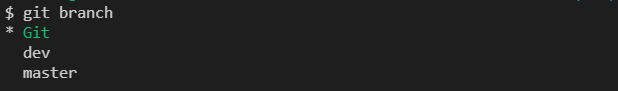

### Configuring user information used across all local repositories.
To set Username
```
git config --global user.name “[firstname lastname]”
```

To set Email
```
git config --global user.email “[email]”
```
---
### Configuring user information, initializing and cloning repositories
Initialize an existing directory as a Git repository
```
git init
```

Retrieve an entire repository from a hosted location via URL
```
git clone [url]
```
example,
```
git clone https://github.com/Shrimad-Bhagwat/Git-Github.git
```
---
### STAGE & SNAPSHOT
Show modified files in working directory, staged for your next commit
```
git status
```


---

Add a file as it looks now to your next commit (stage)
```
git add [file]
```


Unstage a file while retaining the changes in working directory
```
git reset [file]
```


Difference of what is changed but not staged
```
git diff
```


Difference of what is staged but not yet commited
```
git diff --staged
```


Commit your staged content as a new commit snapshot
```
git commit -m "[descriptive message]"
```


---

### BRANCH & MERGE
List your branches. 
A * will appear next to the currently active branch
```
git branch
```


Create a new branch at current commit
```
git branch [branch-name]
```


Switch to another branch
```
git checkout [branch-name]
```


Merge the specified branch into current one
```
git merge [branch]
```


Show all commits in the current branch's history
```
git log
```


Add a git URL as an alias
```
git remote add [alias] [url]
```


Merge a remote branch into your current branch to bring it up to date
```
git merge [alias]/[branch]
```
Transmit local branch commits to the remote repository branch
```
git push [alias] [branch]
```


---
